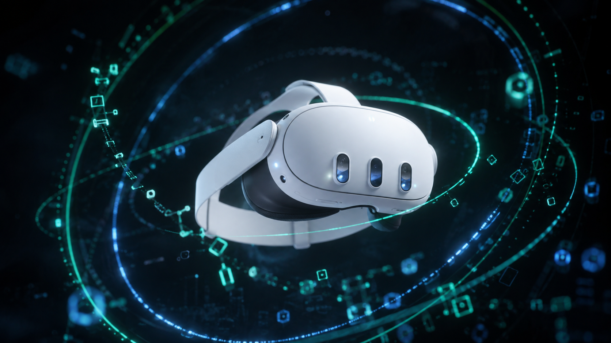
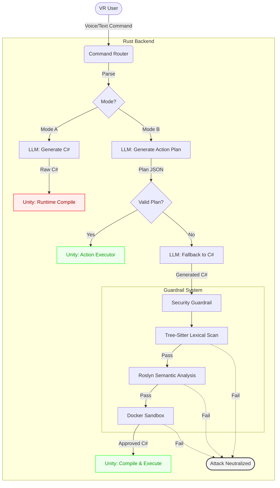

# DreamCodeVR+


**Speak it. Generate it. Experience it safely in VR.**

DreamCodeVR+ extends the original DreamCodeVR research project with a modern Quest 3 execution pipeline and a unified, multi-layered security architecture for AI-generated VR behaviour.

A user can say:
> *"Generate me a solar system."*

The system converts the speech to text, asks an AI model to describe and create the scene, validates the result, and then builds it inside VR. 

The critical difference in DreamCodeVR+ is that generated behaviour is **NOT** blindly trusted. The AI proposes the behaviour, but rigorous validation layers and a Docker Sandbox decide what is allowed to execute.

## ✨ What is DreamCodeVR?
DreamCodeVR is prior research by Giunchi et al. ([paper](https://discovery.ucl.ac.uk/id/eprint/10190408/)). It democratised VR behaviour design by allowing users to speak their intent:
`Speech → speech-to-text → LLM → generated Unity C# behaviour → VR world changes`

However, the original system compiled and ran the generated C# directly inside the Unity process at runtime without a validation gate. While highly expressive, running AI-generated code directly inside the user's headset poses massive security and safety risks.

## 🌟 What does DreamCodeVR+ add?
DreamCodeVR+ keeps the magic of the original system but completely rebuilds how the code is validated and executed.

| Area | Original DreamCodeVR | DreamCodeVR+ |
| :--- | :--- | :--- |
| Speech authoring | ✅ | ✅ |
| LLM-generated behaviour | ✅ | ✅ |
| **Rust safety backend** | — | ✅ |
| **Bounded action-plan mode** | — | ✅ |
| **Generated C# validation** | — | ✅ |
| **Docker Sandbox Isolation** | — | ✅ |
| **XR-specific safety rules** | — | ✅ |
| **Quest 3 execution** | Sideloaded Quest 1/2 only | ✅ Sideloaded on Quest 3 (via ILRuntime) |
| **Deterministic security benchmark** | — | ✅ |

## 🔢 Project at a Glance
| Metric | Value |
| :--- | :--- |
| Project-owned Rust | ~22,815 LOC |
| Project-owned Unity C# | ~20,594 LOC |
| Combined project-owned source | ~43,409 LOC |
| Default Rust test run | 377 tests |
| XR benchmark | 40 malicious + 12 benign |
| Large corpus | 1,057 inputs |
| Physical headset | Meta Quest 3 |

## 🎙️ The Simple Idea
The core idea behind DreamCodeVR+ is: **The AI proposes. The safety layer decides.**

Instead of scattering disjointed security systems, DreamCodeVR+ relies on a completely unified **Two-Mode Architecture**:

### 🔴 Mode A (The Baseline)
The baseline generates raw C# directly from the user's prompt and sends it to the headset for runtime compilation. It has no security guardrails and blindly trusts the LLM. It is maintained strictly as the vulnerable comparison baseline.

### 🟢 Mode B (Secure DreamCodeVR+)
The secure, unified architecture. It completely drops the reliance on runtime C# compilation where possible, favouring a safe-by-construction approach.
1. **Action Plans**: The system first attempts to generate a bounded JSON `ActionPlan`. The plan restricts operations to 6 known-safe verbs (e.g., `set_color`, `move`, `scale`) and is bounded by strict numeric limits before execution.
2. **C# Fallback**: If a creative command cannot be expressed as a bounded action plan, the LLM falls back to generating C#. 
3. **The Guardrail**: Any generated C# must pass a rigorous, 3-phase security gauntlet:
   - **Lexical Scan**: Checked against a Tree-sitter powered denylist, blocking `System.IO`, reflection, dynamic dispatch, and XR boundary evasion.
   - **Roslyn Semantic Check**: A .NET Roslyn analyzer formally verifies the syntax tree.
   - **Docker Sandbox**: The code is evaluated in an isolated Linux container before approval.

If the fallback C# violates any layer of the guardrail, it is safely rejected and the attack is neutralized.

## 🏗️ How the C# validator works
Instead of only searching for bad words, the system parses the structure of the C# program using Tree-sitter.

This catches evasions that simple text search misses, such as aliases:
```csharp
using X = System.IO;
```
By resolving the alias structurally, the validator prevents a simple text bypass.

## 🏗️ Architecture Flow





## 🥽 Why normal code security is not enough for VR
Normal computer security understands things like reading files or opening network connections. But VR introduces APIs that may be perfectly legitimate for a computer, but highly dangerous to the wearer.

For example, an AI could generate code to:
- move the tracking origin while you are walking
- change your viewpoint rapidly, causing sickness
- hide or manipulate your Guardian boundary
- access camera capture or manipulate sensitive XR/environment capabilities

### 🔍 Dual-Use XR APIs
The policy deliberately does **NOT** simply ban every XR API.

Useful APIs such as `OVRPassthroughLayer`, `OVRHand`, `OVRSkeleton`, `OVREyeGaze`, `OVRFaceExpressions`, and `OVRSpatialAnchor` can be highly valuable for legitimate mixed-reality experiences.

Rather than globally banning every useful XR sensor API, the policy can allow legitimate XR functionality while separately rejecting dangerous capabilities such as network transmission or file access.

This preserves useful XR functionality while reducing obvious data-exfiltration paths.

(Similarly, the microphone is not globally banned; specific payloads are rejected due to `System.Net` exfiltration risks, not bare microphone access).

## 🧪 XR Security Evaluation
We measured the system against a fixed benchmark of 40 malicious payloads and 12 benign controls.

| Defence Level | Malicious payloads rejected |
| :--- | :--- |
| No defence | 0 / 40 |
| Conventional code security | 15 / 40 |
| **XR-aware static policy (Mode B)** | **38 / 40** |

The XR-aware static policy rejected 38/40 malicious payloads while admitting all 12 tested benign controls.

0/12 benign controls were rejected in this benchmark.

### The Five Benchmark Classes
| Class | Conventional | XR-aware |
| :--- | :--- | :--- |
| Biometric | 5/8 | 8/8 |
| Positional | 3/8 | 8/8 |
| Surroundings | 6/8 | 8/8 |
| Human Joystick | 0/8 | 6/8 |
| Guardian/Chaperone | 1/8 | 8/8 |

### Why two attacks remain
The Human Joystick class stopped 6/8 attacks, leaving two residual payloads unblocked by static admission. Both of these attacks use ordinary `Camera.main.transform` movement. A single camera movement is normal Unity code. The danger only appears when small, imperceptible movements accumulate over time to steer a user into a real-world wall. A static validator sees source code, not the full future runtime behaviour, demonstrating the honest limit of static admission.

*(A runtime UserFrameGuardian mechanism exists in the research code as a mitigation direction, but it has not been evaluated against these two residual attacks on-device).*

## 🥽 Running on Quest 3


The project was evaluated both via a deterministic local benchmark (to test the backend validator) and live on a physical Meta Quest 3. 

The general Quest story includes:
- all six Mode B (Action Plan) actions demonstrated on physical Quest
- live adversarial requests were refused
- refusal reasons could be shown on the headset
- benign commands were demonstrated
- generated C# was compiled on the backend and IL interpreted on Quest
- measured Quest performance was around 72 fps median

*(Do not confuse these live demonstrations with the 40-payload benchmark, which was run deterministically offline).*

## 📁 Repository Structure
```
DreamCodeVR+/
 ├── apps/
 │   ├── dreamcodevr-server/   # The main Rust backend server
 │   ├── xr-security-eval/     # The deterministic security benchmark
 │   └── test-quest-client/    # The end-to-end integration test client
 ├── crates/
 │   ├── command-router/       # Orchestrates the 2-Mode architecture
 │   ├── behaviour-dsl/        # Defines Mode B Action Plans
 │   ├── csharp-policy/        # Lexically validates C#
 │   ├── roomserver/           # Embedded Rust Ubiq server
 │   └── sandbox/              # Docker Sandbox evaluation runtime
 ├── unity-quest/              # The Meta Quest 3 Unity Client
 ├── redteam/                  # The 1,057-vector adversarial corpus
 └── scripts/                  # CI, testing, and deployment scripts
```

## 🐛 Lessons from real bugs
- **Object names becoming `DCVRGEN_Cube`**: We told the AI to name objects meaningfully, but provided a prompt example where the name was `DCVRGEN_Cube`. The AI ignored our instructions and blindly followed the example!
- **A rendering defect every test missed**: Our tests proved objects were correctly placed in space, but a stereo rendering bug drew them twice (once per eye with no offset). The test was right, but it tested the wrong dimension.
- **Optimising the wrong thing**: We tried to fix lighting and halved the framerate. Bisection proved it was the new lights, not the generated objects, dragging the performance down.

## 🚀 Getting Started

**Prerequisites:** Rust 1.96+, Unity 6000.5.x.

1. Clone the repository.
2. (Optional) Copy `.env.example` to `.env` and add your own `OPENAI_API_KEY`.

### macOS Easy Launch
For macOS users, the repository includes double-clickable launcher scripts that automatically boot the required systems:
- **`Start-DreamCodeVR.command`**: Boots the live backend (in Secure Mode B) and embedded RoomServer, providing the IP address to enter into your Quest headset.
- **`Run-Security-Benchmark.command`**: Runs the 40-attack deterministic XR security benchmark.
- **`Test-And-Verify-All.command`**: Runs the massive 377-test suite and verifies the integrity of the entire pipeline.

### CLI Launch
Alternatively, you can run the system manually via the terminal:

```bash
# Start the pipeline ready for a Quest 3 connection
./run.sh embedded

# Run the deterministic security benchmark
cargo run --release -p xr-security-eval

# Verify the entire workspace natively
bash scripts/verify-all.sh
```

🙏 **Credits**
This project builds upon the fantastic prior work of Giunchi et al. at University College London. (See the original [DreamCodeVR Paper](https://discovery.ucl.ac.uk/id/eprint/10190408/)).
