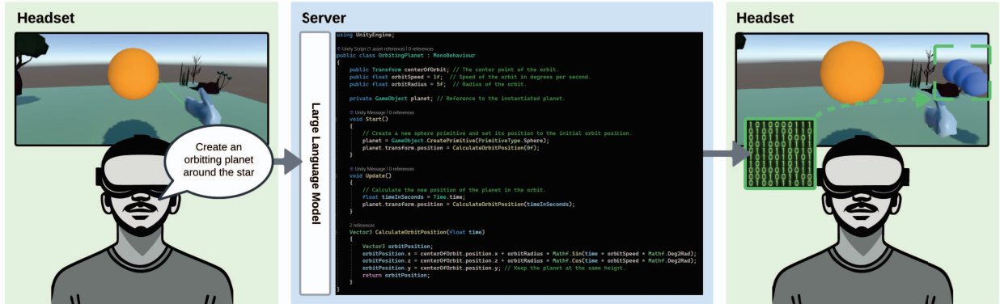

# DreamCodeVR
DreamCodeVR is a Unity project developed at UCL based on Ubiq Social VR Platform and Ubiq Genie (plugin for backend services). It is designed to assist users, irrespective of their coding skills, in crafting basic object behavior in VR environments by translating spoken language into
code within an active application. 



Dreamcode VR is based on Ubiq and Ubiq Genie. Ubiq is a framework developed by UCL for social VR experiments, and Ubiq-Genie is a framework that enables you to build server-assisted collaborative mixed reality applications with Unity using the [Ubiq](https://ubiq.online) framework.

## Current Setup

Use this section for the current DreamCodeVR fork.

### Required tools

- Unity `6000.3.9f1`
- Node.js with npm
- Python `3.12` recommended for `Server/samples/venv`
- OpenAI API key for code generation
- Access to faster-whisper STT HTTP at `http://130.136.2.161:50101`

### Install server dependencies

```powershell
cd Server
npm install
```

```powershell
cd samples
py -3.12 -m venv .\venv
.\venv\Scripts\Activate.ps1
python -m pip install --upgrade pip
pip install -r requirements.txt
```

If PowerShell blocks activation:

```powershell
Set-ExecutionPolicy -Scope CurrentUser RemoteSigned
```

### Configure API keys

Set secrets in the same terminal before starting the server. Do not commit API keys.

```powershell
$env:OPENAI_API_KEY="sk-proj-your-real-key"
$env:OPENAI_MODEL="gpt-5.5"
$env:OPENAI_MAX_COMPLETION_TOKENS="1000"
```

For the AgenticXR path, Claude replaces the legacy OpenAI code generator. Set the
Anthropic key only in the terminal that starts the server:

```powershell
$env:ANTHROPIC_API_KEY="sk-ant-your-real-key"
$env:STT_HTTP_URL="http://your-faster-whisper-host:50101/stt/transcribe"
cd Server
npm run doctor
npm run start:agenticxr
```

`npm run start:agenticxr` enables `AGENTICXR_MODE=claude` automatically. It keeps
the Ubiq room server, speech capture and STT in this process, then starts one Claude
Agent SDK orchestration turn for each completed headset utterance. API keys must not
be written into `.mcp.json` or any committed JSON file.

Current STT uses faster-whisper HTTP, not Azure Speech STT. Defaults:

```powershell
$env:STT_HTTP_URL="http://130.136.2.161:50101/stt/transcribe"
$env:STT_SAMPLE_RATE="16000"
$env:STT_CHANNELS="1"
$env:STT_BITS_PER_SAMPLE="16"
$env:STT_REQUIRE_RECORDING="true"
```

Health check:

```powershell
curl.exe http://130.136.2.161:50101/health
```

### Run DreamCodeVR

```powershell
cd Server\samples\apps\code_runtime_generator
node app.js
```

Then open the Unity project from the `Unity` folder with Unity `6000.3.9f1`, open `Unity/Assets/Demos/DynamicCompiler/DynamicCompiler.unity`, verify the `Room Client` points to the server IP and TCP port `8009`, then press Play or build to device. The AgenticXR runtime installs itself when this scene loads; no manual component placement is required.

In VR, hold the left controller trigger to record speech. Release it to send the utterance to STT. Point at an object with the ray to select it; red ray means selected target.

In AgenticXR mode, keep the ray on the target when recording starts so its stable
object ID is sent with the audio session. Claude queries that object, validates the
generated behaviour on an inactive staging clone, and either applies a low-risk
automatic proposal or displays the world-space Approve/Reject/Undo panel.

### Git hygiene

Generated folders such as `Server/samples/venv`, `node_modules`, Unity `Library`, `Temp`, `obj`, runtime logs, and sample input/output files are ignored. If any of those are already tracked, remove them from Git with `git rm --cached` so they stay on disk but stop being pushed.

## Features

Ubiq's goal is to enable your networked project. It includes message passing, room management, rendezvous and matchmaking, object spawning, shared binary blobs, multiple synchronisation models, lighweight XR interaction examples, customisable avatars and voice chat across Windows, Linux, Android, MacOS, and Javascript running in the browser.

## Quick Start

These instruction will get you a copy of the project up and running on your local machine to run the samples and to start building your own applications. Alternatively, [GitHub Codespaces](https://docs.github.com/en/codespaces) can be used to quickly set up a server and run the server-side components of the samples (in this case, you may skip installing Node.js, step 2, and step 3).

0. Install [Unity](https://unity3d.com/get-unity/download) and [Node.js](https://nodejs.org/en/download/).

1. Clone this repository somewhere on your local PC.

```
git clone git@github.com:UCL-VR/ubiq-genie.git Ubiq-Genie
```

2. Open a terminal in the `Genie` folder and run `npm install` to install the dependencies. This includes the Node.js server of Ubiq.

3. Create a virtual environment and install the Python dependencies:

    ```
    python -m venv venv
    source venv/bin/activate
    pip install -r requirements.txt
    ```

    Note: on Windows, run `venv\Scripts\activate.bat` instead of `source venv/bin/activate`.

4. In Unity, open the `Unity` folder. To add Ubiq to the `Unity Hub`, open the `Unity Hub`, click `Add`, then navigate to `/Ubiq/Unity` and click `Select Folder`.

5. Read the README file in the corresponding folder in the `Server/samples/apps` folder for further setup instructions. For a list of available samples, see the [Samples](#samples) section below.

## Code Runtime Generator

The `Server/samples` folder contains a number of samples that demonstrate how to use Ubiq-Genie and so DreamcodeVR. For more information on how to use these samples, please refer to the README files in the corresponding folders. Currently, the following collaborative samples are available:

- [**DreameCodeVR**](Server/samples/apps/code_runtime_generator/README.md): generates a code that will be used to build procedural behaviours inside the 3D environment.

## Other Samples from Ubiq Genie

The `Genie/samples` folder contains a number of samples that demonstrate how to use Ubiq-Genie. For more information on how to use these samples, please refer to the README files in the corresponding folders. Currently, the following collaborative samples are available:

- [**Texture Generation**](Server/samples/apps/texture_generation/README.md): generates a texture based on voice-based input and an optional ray to select target objects
- [**Multi-user Conversational Agent**](Server/samples/apps/virtual_assistant/README.md): a conversational agent that can be interacted with by multiple users
- [**Transcription**](Server/samples/apps/transcription/README.md): transcribes audio streams of users in a room

For a demo video of the samples, please refer to the [Ubiq-Genie demo video](https://youtu.be/cGz0z9BIgQk).


## to do list

- add components (done)

- add objects (done)

- track all the objects in the scene

- track all components in the scene

- replace object (versioning)

- replace component (versioning)

- a custom component defined in framework needs to be known by compiler

- positioning in the hierarchy and the 3D space

- change values of public variables of the components (include linking objects)

- make an interaction between two (or more) objects (need a visible ID for the object known by the model)

- ​improve prompt programming (probably needs to be dynamic; prompt needs to change during the session)

- add interaction for checking only when use activate the recording session

- upgrade to ubiq 0.5.0

 

General Aspects to be tackled

- clashing between valid instructions, conflict handler 

- how to deal with code that does not work or not doing the required action (but can build, which visual feedback? how to edit?)

- security (we can inject what we want in a Quest)

- for the collaborative aspect, make all networked objects
    -- collaborative dynamic programming
       - the object has to be networked for the parameters need to be shared (gpt this for creating a prompt https://ucl-vr.github.io/ubiq/creatinganetworkedobject/)
       - no clashing


- store the created scene  (do not know if it is possible - versioning) (and so restore)
