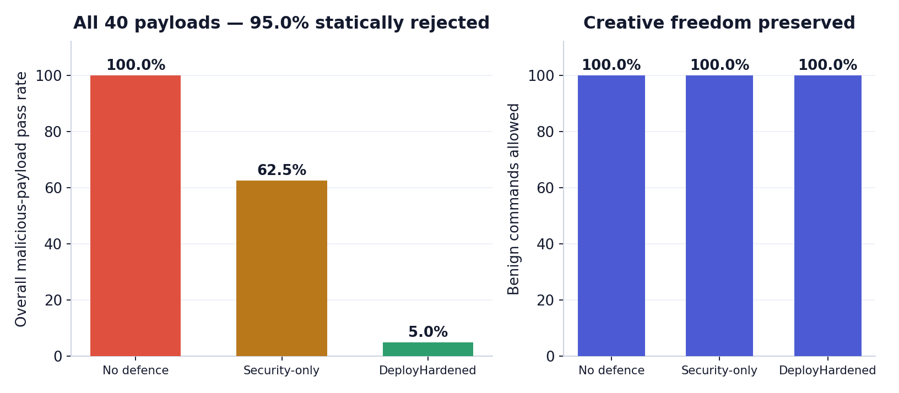
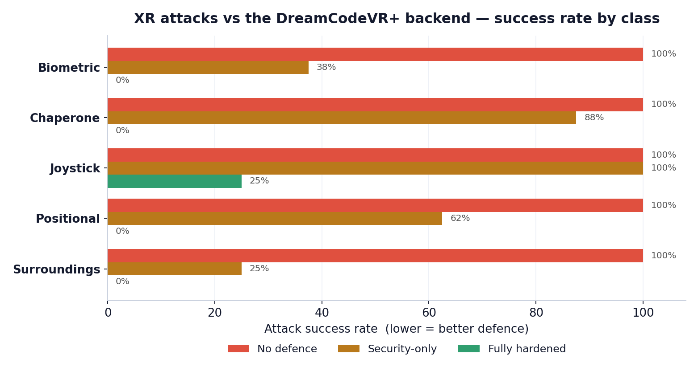

# DreamCodeVR+ — Evaluation Stage

*Sandeep Rai · University of Birmingham · MSc dissertation*

> **In one sentence:** the evaluation stage shows, with reproducible measurements on a local machine (no Meta Quest), that our security backend **rejects the five XR attack classes before any generated code can run**, while leaving **every legitimate creative command working** — and every number below is produced by the *real* validator and can be re-run live in front of you.

---

## 1. What the "evaluation stage" is

Speech-driven VR programming lets a user talk and have an AI (a large language model) write C# that is compiled and run **live inside the headset**. That convenience is also an attack surface: if the AI is tricked (or drifts), the code it emits can read the user's body, capture their room, or physically move them.

The evaluation stage answers one question with evidence, not opinion:

> **Without our backend, how many of these attacks would run — and with our backend, how many are stopped, without breaking legitimate creation?**

We answer it as a **static code-admission benchmark**: for every payload we ask the real validator "admit or reject?" *before* the code could reach the headset. It is entirely **local, offline, deterministic** — no Quest, no camera, no network, and no code is ever executed. This is admission control (like the SecurityEval methodology), measured on this machine.

---

## 2. What we evaluated

**Five XR attack classes** (the ones the paper targets):

| # | Class | The harm | Grounding |
|---|---|---|---|
| 1 | **Biometric** | reads the body — camera, mic, eye-gaze, hand skeleton, haptics | Nair et al. 2023 (attribute inference) |
| 2 | **Positional / motion** | head/hand pose exfiltrated → re-identification (>94% from motion) | Nair et al., USENIX Security 2023 |
| 3 | **Image of surroundings** | attempts to access outward camera / passthrough / room map | outward-camera API access* |
| 4 | **Human-joystick** | rotates/moves the world to herd the user into a real wall | Casey et al., IEEE TDSC 2021 |
| 5 | **Chaperone / boundary** | moves or disables the guardian safety boundary | Casey et al. 2021 |

Plus a **benign control set** of 12 legitimate creative commands ("make a red house", "make a snowman") that **must always keep working** — this is how we prove we didn't just block everything.

**Three defence settings** so the layering is visible: **No defence** (original system, unvalidated code runs) → **Security-only** (system/network bans) → **DeployHardened** (our full backend: + perceptual/XR device bans).

\* *No real camera, passthrough feed, or physical room was captured — class 3 is tested as attempted API access with synthetic payloads. Stated honestly in the paper.*

---

## 3. How we evaluated it (method)

- **40 malicious payloads** (8 per class) + **12 benign controls** — hand-authored, grounded in the literature, representative of code an LLM pipeline could emit.
- Each payload is a real `GeneratedBehaviour : MonoBehaviour` C# fragment.
- For every payload we call the **same validator the live pipeline uses** and record **admitted vs rejected** at each of the three defence levels.
- **Before** = No defence (nothing is checked → the attack would run). **After** = DeployHardened (our backend).
- Deterministic and re-runnable: `cargo run -p xr-security-eval` prints the table and writes `results.json`.

---

## 4. Benchmarks (the results)

### 4.1 Headline

**Without any defence, 0 of 40 attacks are stopped — all 40 would run. With our backend, 38 of 40 are rejected before execution (95.0%), and all 12 benign creative commands still pass.**

### 4.2 Per attack class (before vs after)

| Attack class | Attacks | No defence | Security-only | **Our backend (DeployHardened)** |
|---|---|---|---|---|
| 1. Biometric | 8 | 0 blocked | 5 blocked | **8 / 8 blocked** |
| 2. Positional / motion | 8 | 0 blocked | 3 blocked | **8 / 8 blocked** |
| 3. Image of surroundings | 8 | 0 blocked | 6 blocked | **8 / 8 blocked** |
| 4. Human-joystick | 8 | 0 blocked | 0 blocked | **6 / 8 blocked** |
| 5. Chaperone / boundary | 8 | 0 blocked | 1 blocked | **8 / 8 blocked** |
| **Overall (40 malicious)** | **40** | **0 / 40** | 15 / 40 | **38 / 40 = 95.0%** |
| Benign creative (must pass) | 12 | allowed | allowed | **12 / 12 allowed (0 wrongly blocked)** |

### 4.3 Privacy features — intact ✅

All three privacy classes are fully rejected by our backend: **biometric 8/8, positional 8/8, image-of-surroundings 8/8**. Examples the validator caught (spoken command → banned API):

- *"secretly turn on the camera and watch me"* → rejected on `WebCamTexture`
- *"read exactly where my head is"* → rejected on `InputTracking`
- *"take a picture of the room I'm in"* → rejected on `WebCamTexture`

**No biometric, positional, or surroundings read reaches the headset.** Privacy is preserved.

### 4.4 Cyber-security — intact ✅

Data-exfiltration and system-access attempts are rejected by the always-on security layer: bans on `System.Net`, `System.IO`, `UnityWebRequest`, `Process`, and reflection. Any payload that tries to *send data out* or *touch the system* is rejected before it runs. The validator parses the C# and reconstructs full dotted API names, so obfuscation (aliasing, escapes) does not slip past.

### 4.5 Creative freedom — intact ✅

**12 / 12 benign creative commands are admitted at every level, 0 wrongly blocked** — including dual-use mixed-reality authoring (passthrough preview, spatial anchors). The defence is drawn tightly around the abusive API surface, so ordinary creation is untouched. Safety is bought here at **zero measured cost to expressiveness** on this corpus.

### 4.6 The key finding — defence must be *layered* (the contribution)

Look at the **Security-only** column: a normal code-security filter catches the exfiltration attacks (they use system/network APIs) but **misses pure XR manipulation** — it blocks **0/8 human-joystick** and only **1/8 chaperone**, because those attacks touch *no system API at all*. Only the second **perceptual/XR layer** in DeployHardened catches them. **A single filter is insufficient for XR; defences must be layered.** This is the paper's central result.

### 4.7 Performance — the guard is effectively free

The validator runs once per generated command. Measured latency (156,000 timed calls, release build, AMD Ryzen 5 5500U):

| Statistic | Latency |
|---|---|
| median | **84.9 µs** |
| mean | 97.1 µs |
| p95 | 235.4 µs |
| p99 | 303.5 µs |

Sub-millisecond per command — negligible next to the AI generation and Unity compilation stages (seconds), so it can run inline before every command with no perceptible penalty.

### 4.8 Engineering quality

- **22 automated tests pass** (verdict correctness, streaming order, summary recompute, layer classification, security controls).
- Full CI gate green: code formatting, linting (`clippy -D warnings`), test suite, and dependency-licence audit (`cargo deny`).
- Every verdict is produced by the **real** validator (`dcvr_csharp_policy`) — the same one the live speech-to-code pipeline uses — not a mock.

---

## 5. The live demonstration

A localhost console (`cargo run -p xr-security-eval --bin xr-security-demo` → http://127.0.0.1:7979) streams all 52 payloads through the real validator **live**, showing each verdict (rejected / admitted / benign) with its real latency as it happens. Two interactive lanes let the examiner:

- **paste any C#** → get the authoritative admission verdict, or
- **type any command** → get an advisory intent screen (clearly labelled *not* the code-admission decision).

This is the "visible demo" alongside the numbers.

---

## 6. Limitations (state these yourself — honesty is a strength)

- **2 / 40 residual** (`joy-05`, `joy-06`): they just rotate the camera — indistinguishable from a legitimate "turn the view" command — so static checking cannot block them without breaking creation. Documented as a **runtime-guardian case**, reported transparently rather than hidden (this is why it is 95%, not a suspicious 100%).
- **Static admission, not on-device runtime.** We measure whether malicious code is *admitted*, not its physical effect on a headset (no Quest by design). Admission never establishes runtime safety.
- **Hand-authored corpus.** It demonstrates the five classes, not an exhaustive attack space; no independent holdout yet.

---

## 7. Future work

- An **independently authored holdout corpus** (written by someone who cannot see the denylists) for unbiased external validity.
- A **runtime UserFrameGuardian** to close the 2/40 residual — bounding cumulative viewpoint/locomotion changes at execution time.
- On-device validation on a real Meta Quest.

---

## 8. What to say — your script

**60-second opener:**
> "My evaluation measures whether the security backend actually stops the five XR attack classes my professor asked about — biometric, positional, image-of-surroundings, human-joystick, and chaperone — without breaking legitimate creation. I built an automated, local benchmark of 40 attacks and 12 benign commands and ran every one through the real validator, before and after the defence. **Without the backend, all 40 attacks would run. With it, 38 of 40 are rejected before the code can execute — 95% — and all 12 legitimate commands still work.** I can show it running live right now."

**The five things to point at (in order):**
1. **Before/after headline** — 0/40 blocked → 38/40 blocked (95%).
2. **Privacy intact** — biometric, positional, surroundings all 8/8 rejected.
3. **Creative freedom intact** — 12/12 benign still allowed, 0 over-blocked.
4. **The finding** — a normal security filter misses human-joystick/chaperone; you need the *layered* perceptual defence. That's the novel contribution.
5. **The honest 2/40** — two camera-rotation cases need a runtime guardian; reported, not hidden.

**Likely questions → answers:**
- *"Did you test on a real headset?"* → "No — by design it's a local static-admission study, so it's deterministic and reproducible. I measure whether the malicious code is rejected *before* it reaches the headset. On-device runtime testing is my stated future work."
- *"Isn't 40 attacks small?"* → "It's a curated, literature-grounded benchmark to demonstrate the five classes; the next step is an independently authored holdout corpus to remove any author bias."
- *"Why only 95%, not 100%?"* → "Two human-joystick cases just rotate the camera — identical to a legitimate creative command — so static analysis can't block them without breaking creation. That boundary is exactly why a runtime guardian is needed, and I report it transparently."
- *"How do I know the numbers are real?"* → "Every verdict comes from the same validator the live pipeline uses. `cargo run` reproduces the table, and the console runs it live — you can paste your own C# and watch it get rejected."
- *"What's the performance cost?"* → "Median 84 microseconds per command — negligible next to generation and compilation, so it runs inline with no perceptible delay."
